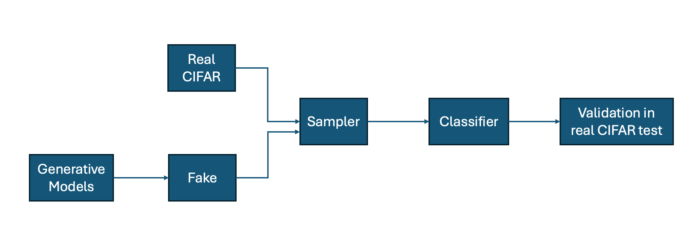
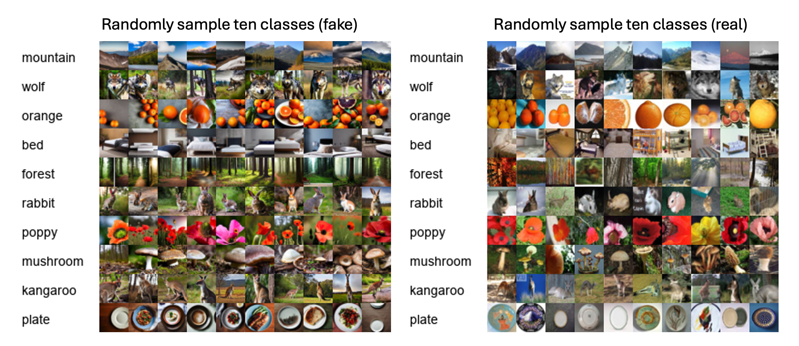
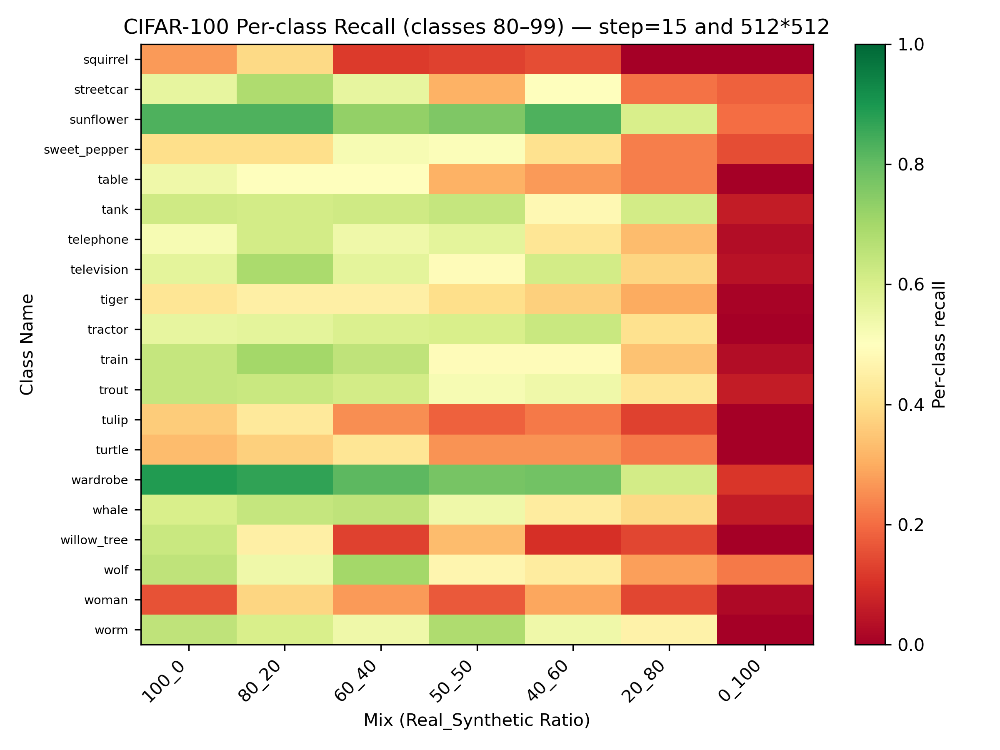
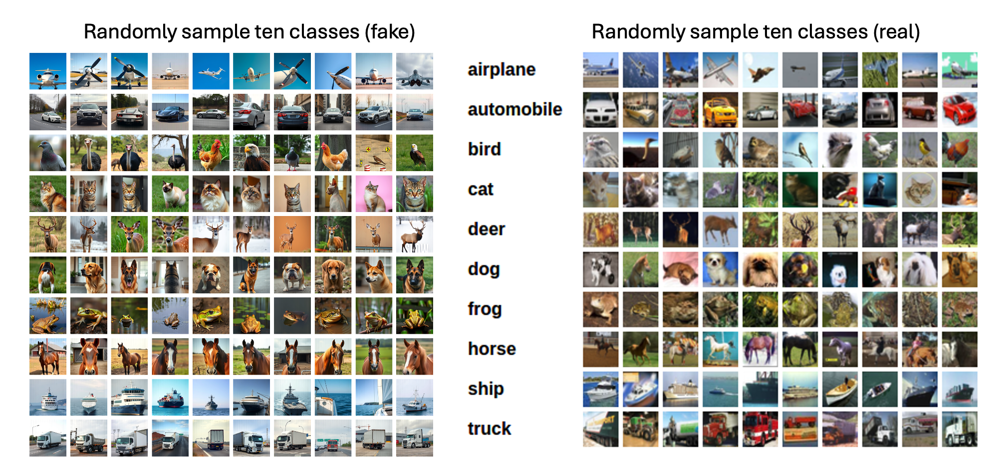
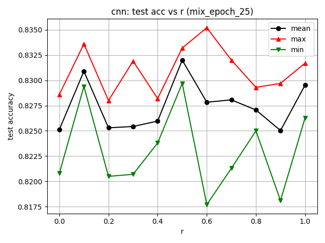
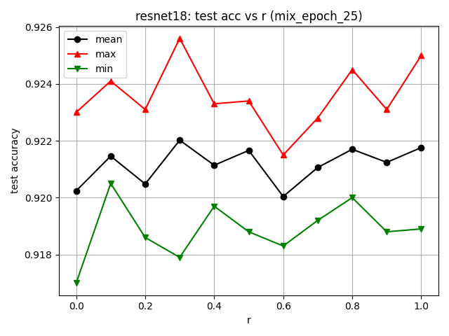
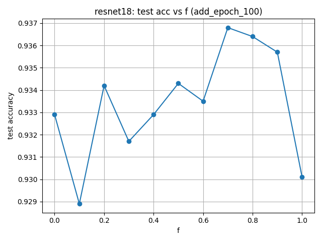

# Hybrid Synthetic Data Augmentation Analysis

Real-synthetic Mixed Dataset Analysis for CIFAR Yuchun Lai, Qinlin He

## Problem Statement

- Goal: analyze how the ratio and realism of synthetic data affect object-detection accuracy Background: Deep-learning–based visual recognition models rely heavily on large, diverse training datasets. However, collecting real-world data (industrial environments) is costly. Recent studies suggest that synthetic data—generated via generative models—can supplement real data to improve model performance. Yet, the optimal mixing ratio between synthetic and real data remains unclear, and the relationship between realism level and performance is underexplored.

## Related Work

- Azizi et al., 2023, TMLR – Synthetic Data from Diffusion Models Improves ImageNet Classification Burg et al., 2023 – Image retrieval outperforms diffusion models on data augmentation Alimisis et al., 2025 – Advances in diffusion models for image data augmentation (survey) Zhou et al., 2024 – A Survey on Data Augmentation in the Large Model Era

## Approach

- Data Generation: Recreate synthetic samples using StableDiffusion and FLUX-schnell. Hybrid Dataset Construction: Create mixed datasets with varying ratios From [100% real, 0% syn] to [0% real, 100% syn]). From [100% real, 0% syn] to [100 % real, 100% syn]).

- Model Training and Evaluation Train a Resnet-18 on each hybrid dataset configuration using identical hyperparameters. Evaluation will be conducted on a fixed real-world test set.

## Flowchart

## Prompt Engineering

- Class-Aware Prompt Prompts are designed per category, aligned with CIFAR-100 characteristics Prompts pools are used to sample and combine into a more complex and random prompt Explicit constraints: single object, centered plain background simple composition Includes negative prompts to suppress text, logos, and multi-object outputs

## CIFAR 100 Experiment Result

- Yuchun Lai

## Setting

- StableDiffusion Target size (512, 512), step 15 Training CIFAR-100 100 classes and 500 images for each class Synthesis Data Real:Fake -> [100:0, 80:20, 60:40, 50:50, 40:60, 20:80, 0:100] Sampling method: We use the same random seed for all experiments and, for every class, randomly sample real and synthetic images according to the target real:fake ratio.

## Example visualization

## Experiment

- Dataset generated by Stable Diffusion step=15 512*512

## Conclusion

- Weak / low-recall classes benefit the most, gaining significant recall from synthetic samples. Strong / high-recall classes are amounts of synthetic data. harmed, even with small High synthetic ratios (≥80%) always collapse performance due to severe domain shift in complex dataset.

## CIFAR 10 Experiment Result

- Qinlin He

## Example visualization

## Setting

- FLUX-schnell Target size (128, 128), step 4 Training Trained on Resnet18 and naïve CNN CIFAR-10 10 classes and 5000 images for each class Synthesis Data Real:Fake -> [100:0, 90:10, 80:20, … , 10:90, 0:100]

## Experiment (mix, cnn)

## Experiment (mix)

## Experiment (add)

## Conclusion

- High quality synthesis data doesn’t affect training in simple dataset if the total data quantity is not increased. Indicating synthesis data and original data share the same distribution. When adding synthesis data, performance gain reaches peak at around 70% (in total 170% data compare to original real daatset). But the performance drops when adding too much synthesis data.

